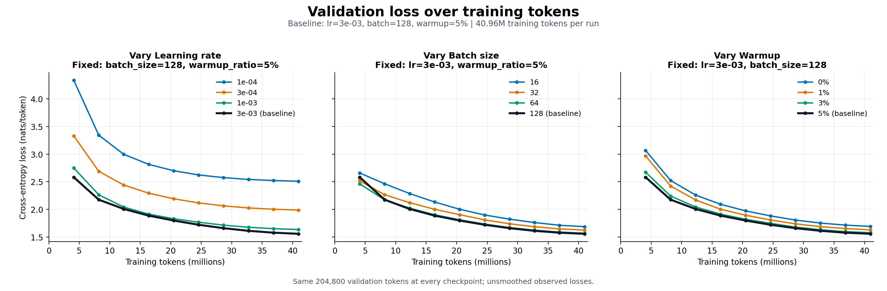
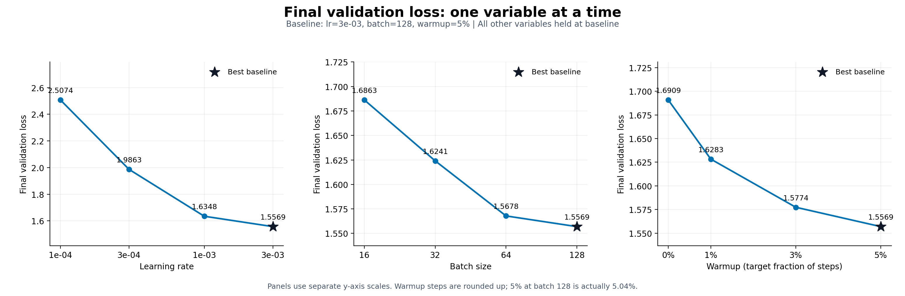
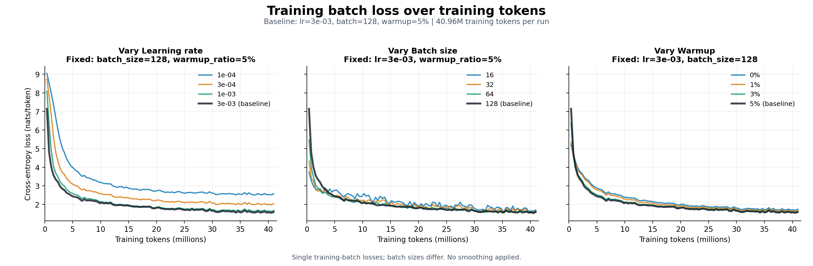

# Assignment 1: TinyStories Training Results

A custom Transformer language model was trained on TinyStories using an **NVIDIA GeForce RTX 5090 (32 GB)**. The experiments include a baseline run and a completed sweep of 64 hyperparameter configurations. Each sweep run processes exactly **40,960,000 training tokens** to compare learning rate, batch size, and warmup fraction under the same token budget.

## Model and Dataset Size

| Property | Value |
| --- | ---: |
| Trainable parameters | 43,803,136 (approximately 43.8 million) |
| Transformer layers | 8 |
| Hidden dimension | 512 |
| Attention heads | 8 |
| SwiGLU intermediate dimension | 2048 |
| Context length | 256 tokens |
| Vocabulary size | 10,000 |
| BPE merges | 9,743 |
| Training dataset tokens | 541,229,347 |
| Validation dataset tokens | 5,465,883 |

The input embeddings and output head have separate weights. The tokenizer uses byte-level BPE with GPT-2 regex pre-tokenization. The special token `<|endoftext|>` has ID 256.

The data comes from the [TinyStories V2 GPT4 training split](https://huggingface.co/datasets/roneneldan/TinyStories/blob/main/TinyStoriesV2-GPT4-train.txt) and [validation split](https://huggingface.co/datasets/roneneldan/TinyStories/blob/main/TinyStoriesV2-GPT4-valid.txt). Tokenizer training used the entire training text (2,227,753,162 bytes) and took 32.66 seconds. Encoding both splits took 43.94 seconds; every shard passed an exact byte roundtrip check.

Each model processes a token budget equivalent to approximately **7.6%** of the training corpus token count. Training samples random windows, so this fraction does not represent a complete pass through that portion of the corpus.

## Experimental Design and Training Budget

The full Cartesian product of learning rates, batch sizes, and warmup fractions contains **4 × 4 × 4 = 64 independent runs**. All 64 runs completed successfully.

| Variable | Candidate values |
| --- | --- |
| Peak learning rate | `1e-4`, `3e-4`, `1e-3`, `3e-3` |
| Batch size | 16, 32, 64, 128 |
| Warmup fraction | 0%, 1%, 3%, 5% |

Every run processes **40,960,000 tokens**, for a combined total of **2,621,440,000 tokens** across the sweep. Update counts and warmup steps vary with batch size:

| Batch size | Tokens per step | Optimizer updates | Warmup steps: 0% / 1% / 3% / 5% |
| ---: | ---: | ---: | --- |
| 16 | 4,096 | 10,000 | 0 / 100 / 300 / 500 |
| 32 | 8,192 | 5,000 | 0 / 50 / 150 / 250 |
| 64 | 16,384 | 2,500 | 0 / 25 / 75 / 125 |
| 128 | 32,768 | 1,250 | 0 / 13 / 38 / 63 |

Warmup steps are rounded up. For batch size 128, the actual fractions are therefore 0%, 1.04%, 3.04%, and 5.04%.

All other settings remain fixed: FP32 training, AdamW betas `(0.9, 0.95)`, weight decay 0.1, gradient clipping threshold 1.0, and random seed 42. After warmup, the learning rate follows cosine decay to 10% of its peak value.

Each run has 10 evaluations, spaced by 4,096,000 training tokens. An evaluation uses 50 batches of size 16, totaling **204,800 validation tokens**. The same fixed windows are used across all runs and evaluations, and validation sampling does not consume the training RNG state. These losses estimate performance on that fixed validation sample, not the entire validation corpus.

## Best Training Result

Among the 64 tested configurations, the lowest final validation loss was obtained with:

| Property | Best configuration and result |
| --- | ---: |
| Peak learning rate | `3e-3` |
| Batch size | 128 |
| Warmup | 5% (63 steps; actual fraction 5.04%) |
| Optimizer updates | 1,250 |
| Training tokens | 40,960,000 |
| Final validation loss | **1.556914** |
| Validation perplexity | **4.744157** |
| Run duration | 403.23 seconds (approximately 6 min 43 s) |
| Training throughput | 104,396 tokens/s |
| Peak allocated memory during training steps | 26.60 GiB |

The following plots use this configuration as the baseline. Each panel varies one hyperparameter while holding the other two at their best values. All curves use the same training-token budget.

### Validation Loss Curves

The horizontal axis measures processed training tokens, allowing comparison across different batch sizes and update counts. Curves show unsmoothed measurements.

### Final Validation Loss versus Hyperparameters

Within these conditional slices, increasing learning rate, batch size, and warmup fraction reduced final validation loss. The three panels use separate vertical-axis ranges, and each point is labeled with its loss.

These are conditional slices through the best configuration; they do not establish that hyperparameter interactions are absent. The best configuration lies at the boundary of the tested range, so conclusions apply only to the tested candidates. The result is also selected on the tuning validation set, rather than evaluated on an independent test set.

### Training Loss Curves

The following plots show unsmoothed losses from individual training batches. Fluctuation levels differ with batch size; training quality should also be assessed using the fixed-sample validation losses.

## Runtime and Memory

Results below are grouped by batch size, with 16 learning-rate/warmup combinations per row. Run duration includes training, validation, and result saving. Throughput measures training steps only.

| Batch size | Mean run duration | Mean training throughput | Peak allocated memory during training steps |
| ---: | ---: | ---: | ---: |
| 16 | 631.03 s (10.52 min) | 66,625 tokens/s | 3.77 GiB |
| 32 | 406.06 s (6.77 min) | 104,117 tokens/s | 7.03 GiB |
| 64 | 396.98 s (6.62 min) | 106,238 tokens/s | 13.56 GiB |
| 128 | 403.77 s (6.73 min) | 104,301 tokens/s | 26.60 GiB |

The sum of all 64 run durations is **29,405.41 seconds, approximately 8 hours 10 minutes**. Throughput improves substantially from batch size 16 to 32, then remains broadly similar at 64 and 128 while memory usage increases. Synchronized performance probes were enabled throughout this sweep, so reported throughput includes their overhead. Memory peaks cover measured training steps only.

## Initial Baseline and Generation Quality

Before the sweep, a baseline model was trained for 10,000 steps using learning rate `3e-4`, batch size 16, and 5% warmup. It also processed 40,960,000 tokens:

| Metric | Baseline result |
| --- | ---: |
| Final validation loss | 1.693185 |
| Validation perplexity | approximately 5.44 |
| Total duration | 785.38 s (approximately 13 min 5 s) |
| Training throughput | 54,300 tokens/s |
| Peak allocated memory during training steps | 3.77 GiB |

This baseline used randomly sampled validation windows, unlike the fixed windows used in the later sweep. Two baseline runs overlapped in time, so their speed does not represent isolated GPU performance.

The baseline checkpoint loaded successfully and passed finite-parameter checks. With temperature 0.8 and a limit of 120 new tokens, it produced recognizable short English stories, but still showed errors in subject reference, grammar, and narrative logic. For example:

> Lily was happy to see her hurt wing. She some strong wings made her wing happier and better.

These samples came from the initial baseline model. The best sweep model has not yet undergone the same generation assessment. Lower validation loss indicates improved prediction on the fixed validation sample; it alone does not establish a corresponding improvement in story quality.
